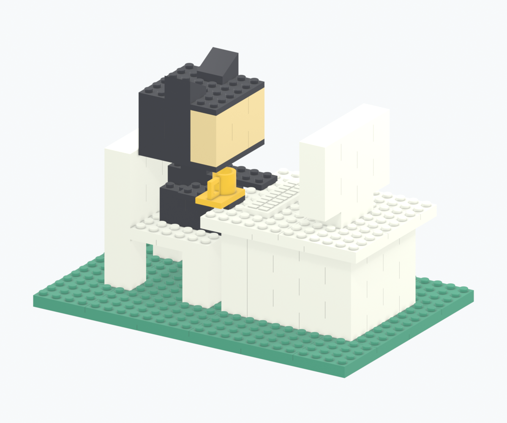

# Desk & Cat-Eared Character — Brick Diorama

**English · [日本語](README.md)**

**[Open the English assembly guide](https://ktanino10.github.io/octodesk-brick-kit/?lang=en) · [Japanese guide](https://ktanino10.github.io/octodesk-brick-kit/) · [Bilingual offline ZIP](https://github.com/ktanino10/octodesk-brick-kit/releases/download/v1.0.1/octodesk-r1-offline.zip)**



An independent, unofficial personal display design inspired by a user-provided photograph: a white desk and chair, a black cat-eared character with a plain light-beige face, and a yellow mug on a green base. The photograph, box, branding and official logos are not included. This is not an official LEGO or GitHub product, and no commercial-brick compatibility or toy certification is claimed.

| Finished dimensions | Production parts | Assembly | Print geometry |
| --- | --- | --- | --- |
| **191.8 × 127.8 × 128.0 mm** | **137 parts / 15 types** | **37 steps / 5 colors** | **8 production 3MF plates; trials separate** |

**P1S / 0.2 mm nozzle / PLA. Every 3MF is NOT_SLICED.** The actual plate, PLA brand and slicer profile are unknown. Actual slicing, fit, retention, warping, strength, tip-over and durability are untested. Digital verification is not a physical qualification. No printer transmission or print start is performed.

**Begin with [one loose-fit pair](https://ktanino10.github.io/octodesk-brick-kit/coupons/01-loose-pair-NOT_SLICED.3mf): FIT-M-D470 + FIT-F-CP12.** Check seating and removal with gentle hand pressure, then test the production 2×2/2×4 parts in a small batch. Do not print the complete kit before physical evaluation. Import STL in millimeters at 100%; do not load the same part twice from both STL and 3MF.

## Files and languages

| Content | Links |
| --- | --- |
| Drawings, sections and all steps | [English PDF](https://ktanino10.github.io/octodesk-brick-kit/docs/assembly-manual.en.pdf) · [Japanese PDF](https://ktanino10.github.io/octodesk-brick-kit/docs/assembly-manual.pdf), 44 pages each |
| Common assembly video | [MP4 / H.264](https://ktanino10.github.io/octodesk-brick-kit/media/assembly.mp4) · [WebM / VP9](https://ktanino10.github.io/octodesk-brick-kit/media/assembly.webm) |
| English subtitles | [SRT](https://ktanino10.github.io/octodesk-brick-kit/media/assembly.en.srt) · [VTT](https://ktanino10.github.io/octodesk-brick-kit/media/assembly.en.vtt) |
| Print geometry and quantities | [Type STL files](dist/octodesk-r1/stl/) · [Color 3MF plates](dist/octodesk-r1/plates/) · [Trials](dist/octodesk-r1/coupons/) · [BOM](dist/octodesk-r1/data/bom.csv) |
| Native and exchange CAD | [Assembly FCStd](https://ktanino10.github.io/octodesk-brick-kit/cad/Octodesk-r1.FCStd) · [Type library FCStd](https://ktanino10.github.io/octodesk-brick-kit/cad/Type-library.FCStd) · [STEP](https://ktanino10.github.io/octodesk-brick-kit/cad/Octodesk-r1.step) |
| Editable render and animation | [Blender](https://ktanino10.github.io/octodesk-brick-kit/cad/Octodesk-r1.blend) |
| Print ↔ assembly mapping | [Interactive guide](https://ktanino10.github.io/octodesk-brick-kit/?lang=en#guide) · [Every slot and candidate](dist/octodesk-r1/data/plate-to-assembly.csv) |
| Complete portable kit | [v1.0.1 bilingual ZIP](https://github.com/ktanino10/octodesk-brick-kit/releases/download/v1.0.1/octodesk-r1-offline.zip) · [Release](https://github.com/ktanino10/octodesk-brick-kit/releases/tag/v1.0.1) · [Hash receipt](dist/release-receipt.json) |

Use **日本語 / English** to switch without resetting selected parts, assembly progress or playback. English direct URL: `?lang=en`. After extracting the ZIP, open `octodesk-r1/index.html`; the language switch and embedded subtitles also work offline with no server, CDN or login.

**Print order is not assembly order. Identical type/color parts are interchangeable.** File → slot → type/color → all candidate instances → step/position/orientation, and the reverse lookup, share the same canonical data. IDs, filenames, dimensions and hashes are not translated.

The shared video retains its **baked-in Japanese header**. English timed text is added as browser subtitles, a synchronized caption beneath the video, and downloadable SRT/VTT. The original video frames are not claimed to be translated or rerendered.

FreeCAD geometry, placements, steps, color names and `PartColor` attributes were verified by native reopening. **Only GUI display colors remain unverified**, because isolated offscreen GUI startup stalled. The model may display default gray; use the bilingual guide or Blender for color identification. Native object labels and the original CSV role field may retain Japanese; stable IDs map them to the English guide.

## Publication and verification

Only the approved source/design outputs are published here, on this repository's Pages site and as Release assets. Reference photos, other projects' artwork, personal information, credentials, local profiles and caches are excluded. PNG text metadata was removed **without changing image pixels**. The original r1 CAD, print geometry, quantities and fit parameters remain byte-identical. The bilingual ZIP has a new hash; the earlier v1.0.0 asset remains available.

The [verification report](dist/octodesk-r1/validation/report.json) records native/STEP correspondence, meshes, interference/insertion paths, support connections, quantities, independent 3MF items, video decoding, and desktop/375px/offline behavior. These are digital checks, not printed-part certification.

**No blanket reuse license has been selected.** Public access alone does not grant unrestricted reuse. See [NOTICE](NOTICE) and [sources and notices](https://ktanino10.github.io/octodesk-brick-kit/docs/notices.en.html). Three.js is redistributed under MIT with its notice.

## Regeneration

`design/kit.json` is the canonical geometry/instance/step data, generated by `scripts/design.py`. English step notes, roles and colors live in `design/translations.json`; static paired UI text lives in `web/index.html`. Both PDFs and subtitle timings use the same instance and step data. Do not independently edit quantities or scale the finished STL.

```sh
python3 -m venv .venv
.venv/bin/python -m pip install -r requirements.txt
npm ci
python3 scripts/design.py
QT_QPA_PLATFORM=offscreen PYTHONPATH="$FREECAD_LIB:scripts" \
  "$FREECAD_PYTHON" scripts/freecad_build.py
QT_QPA_PLATFORM=offscreen PYTHONPATH="$FREECAD_LIB:scripts" \
  "$FREECAD_PYTHON" scripts/native_documents.py
QT_QPA_PLATFORM=offscreen PYTHONPATH="$FREECAD_LIB:scripts" \
  "$FREECAD_PYTHON" scripts/verify_cad.py
.venv/bin/python scripts/package_prints.py
.venv/bin/python scripts/verify_meshes.py
QT_QPA_PLATFORM=offscreen PYTHONPATH="$FREECAD_LIB:scripts" \
  "$FREECAD_PYTHON" scripts/cad_details.py
"$BLENDER" --background --factory-startup --threads 2 --python scripts/blender_scene.py
"$BLENDER" --background --factory-startup --threads 2 \
  dist/octodesk-r1/cad/Octodesk-r1.blend --python scripts/verify_blender.py
.venv/bin/python scripts/encode_movie.py
.venv/bin/python scripts/prepare_publication.py
.venv/bin/python scripts/build_docs.py
node scripts/export_pdf.mjs
npm run build:web
npm run test:web
.venv/bin/python scripts/package_release.py
KIT_DIR="$PWD/build/archive-test/octodesk-r1" \
  BROWSER_REPORT="$PWD/build/archive-browser.json" npm run test:web
.venv/bin/python scripts/package_release.py --finalize
python3 scripts/verify_publication.py --stage
```

Use FreeCAD's matching embedded Python and library ABI. Run isolated offscreen/headless processes, not an existing interactive document. `native_documents.py` writes assembly and type-library FCStd files separately. For rebuilding the original Japanese video header, set `JAPANESE_FONT` to an appropriately licensed installed TTF/TTC if needed; font files are not distributed. If the declared Playwright browser is missing, install it with `npx playwright install chromium`.

For a language/document-only update, do **not** rerun CAD or geometry rendering: run `build_docs.py`, `export_pdf.mjs`, the viewer build/tests, then the packaging/verification steps. Geometry locks intentionally reject unintended changes.

Local server, if desired: `python3 -m http.server 8765 --bind 127.0.0.1 --directory dist/octodesk-r1`. The packaged guide also works directly over `file://`.

The Pages workflow audits files/hashes and exercises both languages before deploying only `build/pages`. Source, dependencies, caches and local configuration are not served as the Pages root. Large ZIP files are Release assets, not Git history. This workflow never operates a printer.
